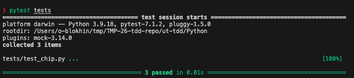
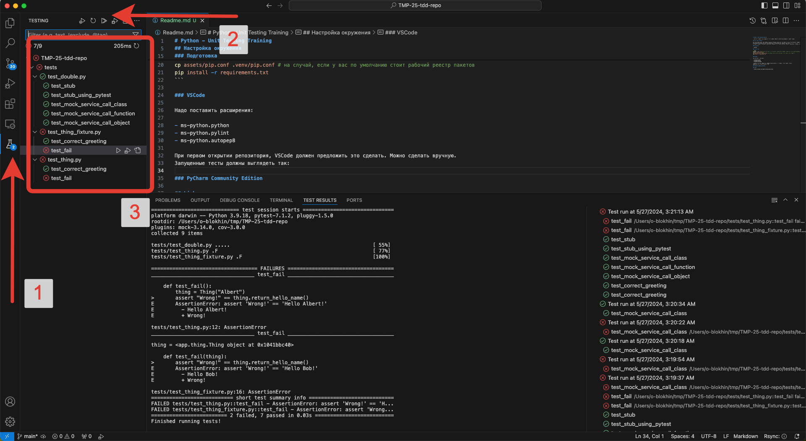
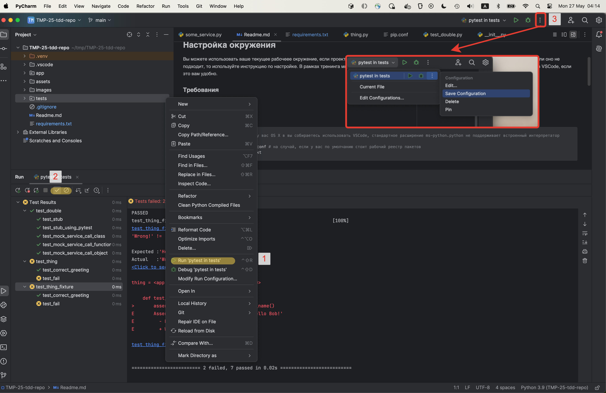

# Python - Unit Testing Training

Привет! Это репозиторий, на базе которого мы будем выполнять практические задания в рамках тренига.

## Настройка окружения

Вы можете использовать ваше текущее рабочеее окружение, если проект открывается в нём и у вас получается запустить тесты.
Если рабочего окружения нет или оно не подходит, то используйте инструкцию по настройке.
В рамках тренинга мы собираемся использовать PyCharm, но вы сможете следовать выполнять упражнения в VSCode, если это вам удобно.

### Требования

- python3 (3.7 - 3.12)

### Подготовка

#### Для Mac

Если у вас OS X и вы собираетесь использовать VSCode, то надо знать, что стандартное расширение ms-python.python не поддерживает встроенный интерпретатор.

**Если у вас python3 из любого другого источника (conda, brew, pyenv), то можно пропустить этот пункт**. Если нет, то вот способ поставить.

```bash
# для OS X, если у вас установлен только встренный интерпретатор
brew install pyenv
pyenv install 3.8.12
pyenv global 3.8.12
```

#### Для всех

```bash
cd ut-tdd/Python
python3 -m venv .venv # 
source .venv/bin/activate
cp .assets/pip.conf .venv/pip.conf # на случай, если у вас по умолчанию стоит рабочий реестр пакетов
pip install -r requirements.txt
pytest tests
```



### VSCode

Надо поставить расширения. При первом открытии репозитория, VSCode должен предложить это сделать. Можно сделать вручную.

- ms-python.python
- ms-python.pylint
- ms-python.autopep8

После запуска тестов, окружение должно выглядеть так. Часть тестов должны быть красными, это нормально.



### PyCharm Community Edition



## Links

- <https://github.com/swkBerlin/kata-bootstraps>
