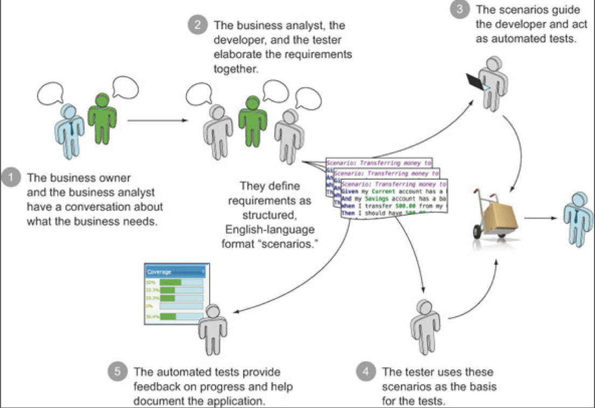

# BDD

## BDD на примере

- Команда, которая не использует BDD
  
  - Сколько этапов передачи информации вы здесь видите?
  - На каких этапах информация может потеряться или исказиться?
  - Какие потери информации есть в ваших продуктах?
  - Какие изменения в процессе вы можете предложить, чтобы свести потери к нулю?

- Команда, которая использует BDD
  
  - В чем вы видите принципиальное отличие?

- Не путайте BDD с форматом описания требований Given/When/Then
- BDD – это способ **общения** команды
  - BDD is a highly collaborative practice, both between users and the development team, and within the team itself. Business analysts, developers, and testers work together with the end users to define and specify features, and team members draw ideas from their individual experience and know-how. This approach is highly efficient.

## Example Mapping как способ проведения PBR
[Статья на habr "Введение в Example Mapping"](https://habr.com/ru/company/oleg-bunin/blog/450844/)

## Структура BDD тестов

- Не пишите автотесты, пишите исполняемые спецификации (примеры использования продукта)
  - Тесты понятны бизнесу
  - Часть билд пайплайна
  - Приемочные и регрессионные
- Не пишите юнит тесты, пишите низкоуровневые спецификации
- Нотация Given/When/Then
- Нотация Shoud

## Упражнение. BDD
- Задача: Познакомиться с BDD подходом к написанию юнит тестов
  - Given.RollDiceGame()
  - Given.Player().WithBet(100).Chips
  - When(player).Wins()
  - Then(player).Gets(600).Chip
- Дебриф: Обращаем внимание на
  - Структуру 
  - Понятность теста
  - Тест должен читаться
  - Коридорное тестирование

## Проверка знаний после блока Unit Testing
- Чем юнит тест отличается от интеграционного теста?
- Что такое хороший юнит тест?
- Какие способы инъекции зависимости вы знаете? Когда какие применяются?
- Чем Stub отличается от Mock?
- Что такое тесты на состояние и поведение?
- Какие паттерны тестируемого дизайна вы запомнили?
- Как тестировать UI юнит тестами?
- Какая польза от DSL в тестах?
- Сформулируйте основную идею BDD в 5 словах

## Полезные материалы
* {height="250"}
* {height="250"}
* {height="250"}
* {height="250"}
